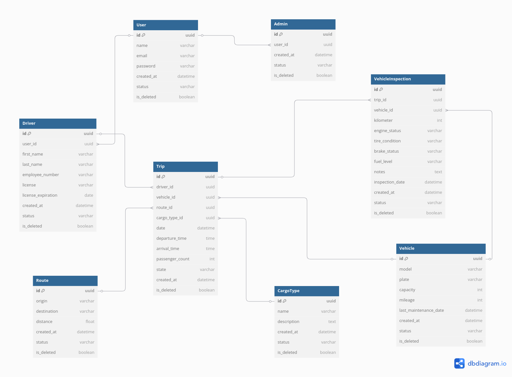

# 🚛 Sistema de Gestión de Unidades de Transporte

# Administración de Base de Datos

El sistema de gestión de unidades de transporte se enfocará en proporcionar una
solución eficiente para el control y administración de una flota vehicular. Permitirá el
registro de cada unidad, asignación de responsables, seguimiento de rutas y
evaluación del estado mecánico de los vehículos. La implementación de este
sistema contribuirá a optimizar procesos, minimizar tiempos de inactividad, reducir
costos operativos y mejorar la planificación logística.

## 📑 Diagrama ER



## Equipo de Desarrollo

- **Gurrola Romero Manuel Eduardo**
- **Marín Ramírez Luis Carlos**
- **Martínez López Gael Ricardo**
- **Cumplido Herrera Diego**
- **Fuentes Reyes Ángel**

## 📋 Tabla de Contenidos

- [Introducción](#introducción)
- [Propósito](#propósito)
- [Objetivos](#objetivos)
- [Público Objetivo](#público-objetivo)
- [Requerimientos](#requerimientos)
  - [Funcionales](#requerimientos-funcionales)
  - [No funcionales](#requerimientos-no-funcionales)
- [Problemática](#problemática)
- [Estructura del Repositorio](#estructura-del-repositorio)
- [Diagrama ER](#diagrama-er)

---

## Introducción

Este repositorio tiene como finalidad identificar y documentar las
necesidades del sistema de gestión de unidades de transporte. Esta base de datos
tiene como objetivo proporcionar un control estructurado y eficiente sobre la
administración de las unidades vehiculares de una empresa, asegurando la
trazabilidad de su uso, la gestión de rutas de entrega, el estado mecánico de cada
unidad y otros datos relevantes.

## Propósito

El propósito de esta documentación es definir las necesidades del sistema de gestión de
unidades de transporte, estableciendo los requerimientos funcionales y no funcionales que
garantizarán una administración eficiente de la flota vehicular. Se busca mejorar la
trazabilidad de las unidades, optimizar las rutas de entrega, gestionar el mantenimiento y
reforzar la seguridad operativa mediante una base de datos estructurada.

## Objetivos

- 🚚 Centralizar la información de las unidades, rutas y responsables.
- 📊 Optimizar la planificación y monitoreo de rutas.
- 🛠️ Gestionar el mantenimiento preventivo y correctivo.
- 🔑 Asegurar la trazabilidad de la información mediante auditorías y seguridad.
- 📈 Facilitar la toma de decisiones con reportes y análisis de datos.

## Público Objetivo

- 🏢 Empresas de transporte y logística.
- 👨‍💼💼 Gerentes de operaciones y supervisores de flota.
- 🚚 Conductores y operadores.
- 🏢 Departamentos de mantenimiento, seguridad, administración y finanzas.

## Requerimientos

### Requerimientos Funcionales

1. **Gestión de Unidades:**

   - Registro de vehículos y estado mecánico.
   - Historial de mantenimiento.

2. **Gestión de Conductores:**

   - Registro y asignación de vehículos.
   - Control de permisos.

3. **Gestión de Rutas:**

   - Registro y optimización de rutas.
   - Control de incidencias.

4. **Mantenimiento:**

   - Programación y alertas de revisiones.
   - Registro de reparaciones.

5. **Seguridad y Auditoría:**
   - Roles, permisos y autenticación.
   - Registro de modificaciones.

### Requerimientos No Funcionales

- **Escalabilidad**: Capacidad de crecimiento sin afectar el rendimiento.
- **Seguridad**: Encriptación y control de accesos.
- **Disponibilidad**: Mínimo tiempo de inactividad.
- **Usabilidad**: Interfaz intuitiva para los usuarios.
- **Compatibilidad**: Integración con sistemas ERP, GPS, etc.

## Problemática

Las empresas de transporte suelen enfrentar dificultades en el manejo de
información clave debido a la dispersión de datos, el uso de registros manuales o
sistemas obsoletos. Esto puede generar problemas como:

- **Falta de trazabilidad**: No contar con un registro claro sobre qué operador
  está a cargo de qué unidad puede dificultar la asignación de
  responsabilidades..

- **Control deficiente del mantenimiento**: La ausencia de un sistema
  automatizado para registrar el estado mecánico de los vehículos puede
  derivar en fallas inesperadas, incrementando costos y tiempos de inactividad.

- **Ineficiencia en la asignación de rutas**: Sin una gestión adecuada de las
  rutas de entrega, pueden generarse retrasos, recorridos ineficientes y
  sobrecostos en combustible.

- **Pérdida o desactualización de datos**: El uso de métodos manuales o
  archivos desorganizados puede llevar a la pérdida de información relevante
  o a la toma de decisiones basadas en datos inexactos..

---

## ⌨️ Scripts para la creación de la base de datos

### 📄 Fragmento de script.sql

```sql
-- Codigo SQL para crear la base de datos

-- Tabla que representa a los usuarios del sistema, base para Admins y Conductores
CREATE TABLE
    "User" (
        id UUID PRIMARY KEY DEFAULT gen_random_uuid (), -- Identificador único generado automáticamente
        name TEXT NOT NULL, -- Nombre del usuario
        email TEXT UNIQUE NOT NULL, -- Correo electrónico único
        password TEXT NOT NULL, -- Contraseña cifrada
        created_at TIMESTAMP DEFAULT CURRENT_TIMESTAMP, -- Fecha de creación
        is_deleted BOOLEAN DEFAULT FALSE NOT NULL -- Borrado lógico
    );

-- Tabla que representa a los administradores del sistema
CREATE TABLE
    Admin (
        id UUID PRIMARY KEY DEFAULT gen_random_uuid (), -- Identificador único del admin
        user_id UUID UNIQUE REFERENCES "User" (id) ON DELETE CASCADE, -- Relación 1:1 con User
        created_at TIMESTAMP DEFAULT CURRENT_TIMESTAMP, -- Fecha de creación
        is_deleted BOOLEAN DEFAULT FALSE NOT NULL -- Borrado lógico
    );

-- Tabla que representa a los conductores
CREATE TABLE
    Driver (
        id UUID PRIMARY KEY DEFAULT gen_random_uuid (), -- Identificador único del conductor
        user_id UUID UNIQUE REFERENCES "User" (id) ON DELETE CASCADE, -- Relación 1:1 con User
        first_name TEXT NOT NULL, -- Nombre del conductor
        last_name TEXT NOT NULL, -- Apellido del conductor
        employee_number TEXT UNIQUE NOT NULL, -- Número de empleado único
        license TEXT NOT NULL, -- Licencia del conductor
        license_expiration DATE NOT NULL, -- Fecha de expiración de la licencia
        created_at TIMESTAMP DEFAULT CURRENT_TIMESTAMP, -- Fecha de creación
        is_deleted BOOLEAN DEFAULT FALSE NOT NULL -- Borrado lógico
    );

CREATE TABLE ...
```

📎 [Ver script.sql script completo](script.sql)

### 📄 Fragmento de storage_procedures.sql
Se usa el siguiente bloque de código para crear los diferentes procedimientos almacenados que se usarán en la base de datos (Se incluyen las funciones usadas por los triggers).

```sql
CREATE OR REPLACE FUNCTION soft_delete()
RETURNS TRIGGER AS $$
BEGIN
  -- Ejecuta la consulta dinámica para actualizar la tabla correcta
  EXECUTE format('UPDATE ONLY %I SET is_deleted = TRUE WHERE id = $1', TG_TABLE_NAME) USING OLD.id;

  -- Retorna el registro original sin eliminarlo
  RETURN OLD;
END;
$$ LANGUAGE plpgsql;

CREATE OR REPLACE PROCEDURE update_trip_status(
  p_trip_id UUID,  -- ID del viaje
  p_new_state TEXT  -- Nuevo estado para el viaje
)
LANGUAGE plpgsql AS $$
DECLARE
  v_vehicle_id UUID;
  v_inspection_exists BOOLEAN;
BEGIN
  -- Verificar si el nuevo estado es válido
  IF p_new_state NOT IN ('PENDIENTE', 'EN_CAMINO_AL_DESTINO', 'CARGA_ENTREGADA', 'EN_CAMINO_AL_ORIGEN', 'FINALIZADO') THEN
    RAISE EXCEPTION 'Estado no válido: %', p_new_state;
  END IF;

  -- Obtener el ID del vehículo asociado al viaje
  SELECT vehicle_id INTO v_vehicle_id
  FROM Trip
  WHERE id = p_trip_id AND is_deleted = FALSE;

  -- Verificar si se encontró el viaje y obtener el ID del vehículo
  IF NOT FOUND THEN
    RAISE EXCEPTION 'No se encontró un viaje con el ID % o el viaje está marcado como eliminado', p_trip_id;
  END IF;

  -- Verificar si el viaje está en estado PENDIENTE y si se ha realizado la inspección del vehículo
  IF p_new_state = 'EN_CAMINO_AL_DESTINO' OR p_new_state = 'EN_CAMINO_AL_ORIGEN' THEN
    -- Verificar si se ha realizado una inspección para el vehículo
    SELECT EXISTS (
      SELECT 1
      FROM VehicleInspection
      WHERE vehicle_id = v_vehicle_id
        AND is_deleted = FALSE
    ) INTO v_inspection_exists;

    -- Si no existe una inspección registrada, no se puede cambiar a los estados 'EN_CAMINO_AL_DESTINO' ni 'EN_CAMINO_AL_ORIGEN'
    IF NOT v_inspection_exists THEN
      RAISE EXCEPTION 'No se ha realizado una inspección del vehículo asociado al viaje. No se puede cambiar el estado a "%".', p_new_state;
    END IF;
  END IF;

  -- Actualizar el estado del viaje con el ID proporcionado
  UPDATE Trip
  SET state = p_new_state
  WHERE id = p_trip_id AND is_deleted = FALSE;

  -- Verificar si la actualización fue exitosa
  IF NOT FOUND THEN
    RAISE EXCEPTION 'No se pudo actualizar el estado del viaje con el ID %', p_trip_id;
  END IF;

  -- Puedes agregar más lógica aquí, como registrar en una tabla de auditoría si lo deseas
END;
$$;

CREATE OR REPLACE FUNCTION soft_delete_user_when_driver_or_admin_is_deleted()
RETURNS trigger
LANGUAGE plpgsql
AS $$
BEGIN
  -- Si se elimina un conductor, marcar el usuario como eliminado
  IF TG_TABLE_NAME = 'driver' AND NEW.is_delete = true THEN
    UPDATE "user"
    SET is_delete = true
    WHERE id = NEW.user_id;
  END IF;

  -- Si se elimina un administrador, marcar el usuario como eliminado
  IF TG_TABLE_NAME = 'admin' AND NEW.is_delete = true THEN
    UPDATE "user"
    SET is_delete = true
    WHERE id = NEW.user_id;
  END IF;

  RETURN NEW;
END;
$$;

CREATE OR REPLACE FUNCTION...
```
📎 [Ver storage_procedures.sql script completo](storage_procedures.sql)
